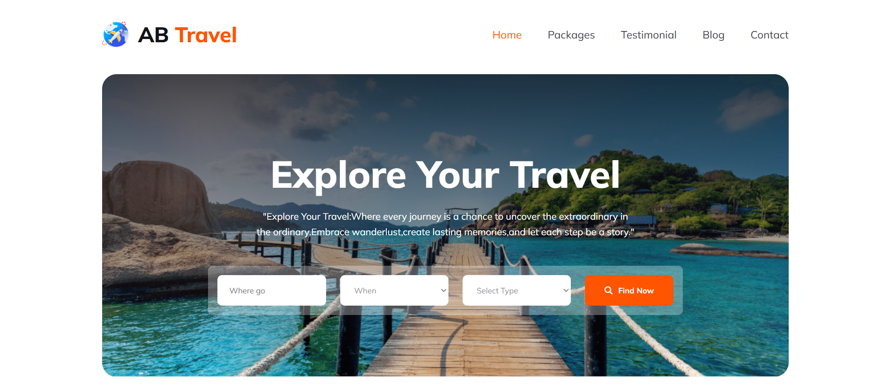

# ✈️ AB Travels — Travel Agency Landing Page

[🔗 Live Demo](https://devo-ab.github.io/ab-travels/)

**AB Travels** is a responsive and visually engaging **travel agency landing page** built using pure **HTML and CSS**. This website showcases travel destinations, tour plans, customer feedback, and more — offering a compelling user experience for exploring and booking travel packages.

---

## ✨ Features

- ✅ Fully responsive layout for all devices
- ✅ Hero section with a strong call to action
- ✅ Popular tours and destination highlights
- ✅ Why Choose Us section to boost trust
- ✅ Deals and Discounts promotions
- ✅ “Perfect Place to Lost” visual callout
- ✅ Ongoing tour planning showcase
- ✅ Feedback and testimonials
- ✅ Newsletter subscription form
- ✅ Clean and modern design with semantic HTML

---

## 🛠️ Tech Stack

| Technology   | Role                       |
| ------------ | -------------------------- |
| HTML5        | Page structure and layout  |
| CSS3         | Styling and responsiveness |
| GitHub Pages | Hosting and deployment     |

---

## 📁 Folder Structure

```
ab-travels/
├── assets/
│   ├── icons/              # Icon assets
│   ├── images/             # Section and tour images
│   ├── logo/               # Website logos
│   ├── video/              # Background or promotional videos
├── css/                    # Main stylesheet (style.css)
├── preview/                # Screenshot images for README
├── index.html              # Main landing page
└── README.md               # Project documentation
```

---

## 📸 Screenshots

### 🖼️ Hero Section



### 🖼️ Tours Plans


### 🖼️ Preview


---

## 🚀 Run Locally

To run this project locally:

1. **Clone the repository**
   ```bash
   git clone https://github.com/your-username/ab-travels.git
   cd ab-travels
   ```

🌐 Deployment
This project is deployed using GitHub Pages.

Deploy in 3 steps:
Push the project to GitHub

Go to Settings > Pages

Select branch: main and folder: / (root) — then click Save

# 👤 Author

# Avi Jit

## :mailbox: Reach me out

<p align="left">
<a href="https://linkedin.com/in/itsavijitb" target="blank"></a>
<a href="https://twitter.com/itsavijitb" target="blank"></a>
<a href="https://facebook.com/itsavijitb" target="blank"></a>
<a href="https://instagram.com/itsavijitb" target="blank"></a>
</p>